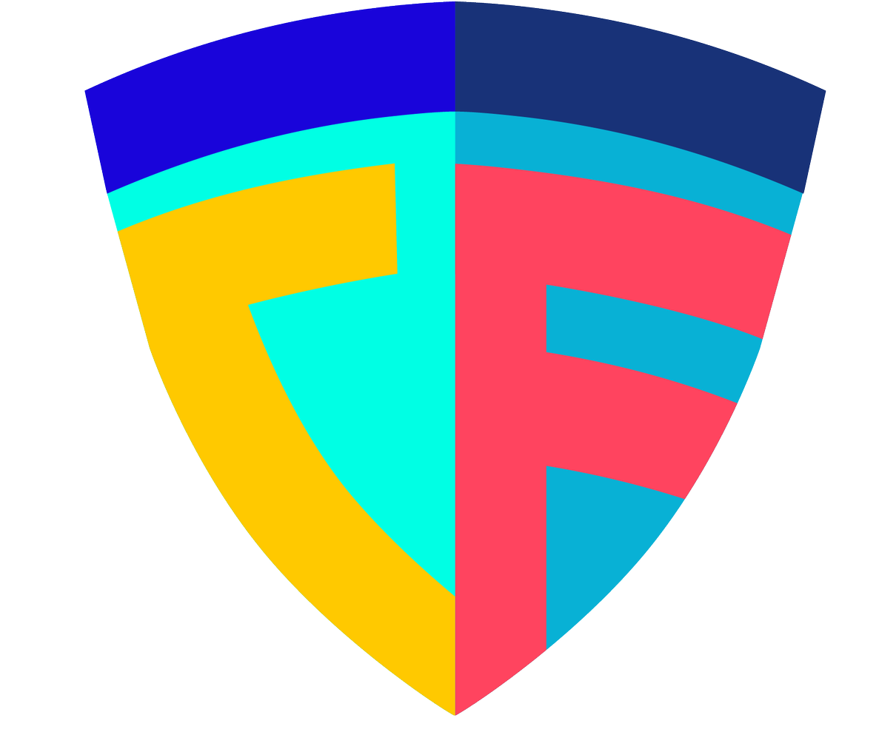

> ⚠️ The CloudFormation scanning logic is now integrated with [Aquasecurity Trivy](https://github.com/aquasecurity/trivy). cfsec will no longer be maintained as a stand alone scanner and Trivy should be used


<p align="center">
  
</p>


[](https://goreportcard.com/report/github.com/aquasecurity/cfsec)
[](https://github.com/aquasecurity/cfsec/releases)


## What is it?

cfsec scans your yaml or json CloudFormation configuration files for common security misconfigurations.

## Installation

### Home Brew - Mac and Linux

```shell
brew tap cfsec/cfsec
```

### Chocolatey - Windows

```shell
choco install cfsec
```

### Scoop - Windows

```shell
scoop install cfsec
```

### Installing latest from source

```shell
go install github.com/aquasecurity/cmd/cfsec@latest
```


## An Example

Given the CloudFormation configuration file below;

```yaml
---
AWSTemplateFormatVersion: "2010-09-09"
Description: An example Stack for a bucket
Parameters:
  BucketName:
    Type: String
    Default: naughty-bucket
  EncryptBucket:
    Type: Boolean
    Default: false
Resources:
  S3Bucket:
    Type: 'AWS::S3::Bucket'
    Properties:
      BucketName:
        Ref: BucketName
      PublicAccessBlockConfiguration:
        BlockPublicAcls: false
        BlockPublicPolicy: false
        IgnorePublicAcls: true
        RestrictPublicBuckets: false
      BucketEncryption:
        ServerSideEncryptionConfiguration:
          - BucketKeyEnabled: !Ref EncryptBucket
```

Running the command `cfsec example.yaml`

The output would be

```
  Result 1

  [aws-s3-block-public-acls][HIGH] Public access block does not block public ACLs
  /home/owen/code/aquasecurity/cfsec/example/bucket.yaml:12-24
   11 |   S3Bucket:
   12 |     Type: 'AWS::S3::Bucket'
   13 |     Properties:
   14 |       BucketName:
   15 |         Ref: BucketName
   16 |       PublicAccessBlockConfiguration:
   17 |         BlockPublicAcls: false    [false]
   18 |         BlockPublicPolicy: false
   19 |         IgnorePublicAcls: true
   20 |         RestrictPublicBuckets: false
   21 |       BucketEncryption:
   22 |         ServerSideEncryptionConfiguration:
   23 |         - BucketKeyEnabled: !Ref EncryptBucket
   24 | 


  Impact:     PUT calls with public ACLs specified can make objects public
  Resolution: Enable blocking any PUT calls with a public ACL specified

  More Info:
  - https://cfsec.dev/docs/s3/block-public-acls/#s3 
  - https://docs.aws.amazon.com/AmazonS3/latest/userguide/access-control-block-public-access.html 

  Result 2

  [aws-s3-block-public-policy][HIGH] Public access block does not block public policies
  /home/owen/code/aquasecurity/cfsec/example/bucket.yaml:12-24
   11 |   S3Bucket:
   12 |     Type: 'AWS::S3::Bucket'
   13 |     Properties:
   14 |       BucketName:
   15 |         Ref: BucketName
   16 |       PublicAccessBlockConfiguration:
   17 |         BlockPublicAcls: false
   18 |         BlockPublicPolicy: false    [false]
   19 |         IgnorePublicAcls: true
   20 |         RestrictPublicBuckets: false
   21 |       BucketEncryption:
   22 |         ServerSideEncryptionConfiguration:
   23 |         - BucketKeyEnabled: !Ref EncryptBucket
   24 | 


  Impact:     Users could put a policy that allows public access
  Resolution: Prevent policies that allow public access being PUT

  More Info:
  - https://cfsec.dev/docs/s3/block-public-policy/#s3 
  - https://docs.aws.amazon.com/AmazonS3/latest/dev-retired/access-control-block-public-access.html 

  Result 3

  [aws-s3-enable-bucket-encryption][HIGH] Bucket does not have encryption enabled
  /home/owen/code/aquasecurity/cfsec/example/bucket.yaml:12-24
   11 |   S3Bucket:
   12 |     Type: 'AWS::S3::Bucket'
   13 |     Properties:
   14 |       BucketName:
   15 |         Ref: BucketName
   16 |       PublicAccessBlockConfiguration:
   17 |         BlockPublicAcls: false
   18 |         BlockPublicPolicy: false
   19 |         IgnorePublicAcls: true
   20 |         RestrictPublicBuckets: false
   21 |       BucketEncryption:
   22 |         ServerSideEncryptionConfiguration:
   23 |         - BucketKeyEnabled: !Ref EncryptBucket    [false]
   24 | 


  Impact:     The bucket objects could be read if compromised
  Resolution: Configure bucket encryption

  More Info:
  - https://cfsec.dev/docs/s3/enable-bucket-encryption/#s3 
  - https://docs.aws.amazon.com/AmazonS3/latest/userguide/bucket-encryption.html 

  Result 4

  [aws-s3-enable-bucket-logging][MEDIUM] Bucket does not have logging enabled
  /home/owen/code/aquasecurity/cfsec/example/bucket.yaml:12-24
   11 |   S3Bucket:
   12 |     Type: 'AWS::S3::Bucket'
   13 |     Properties:
   14 |       BucketName:
   15 |         Ref: BucketName
   16 |       PublicAccessBlockConfiguration:
   17 |         BlockPublicAcls: false
   18 |         BlockPublicPolicy: false
   19 |         IgnorePublicAcls: true
   20 |         RestrictPublicBuckets: false
   21 |       BucketEncryption:
   22 |         ServerSideEncryptionConfiguration:
   23 |         - BucketKeyEnabled: !Ref EncryptBucket
   24 | 


  Impact:     There is no way to determine the access to this bucket
  Resolution: Add a logging block to the resource to enable access logging

  More Info:
  - https://cfsec.dev/docs/s3/enable-bucket-logging/#s3 
  - https://docs.aws.amazon.com/AmazonS3/latest/dev/ServerLogs.html 

  Result 5

  [aws-s3-enable-versioning][MEDIUM] Bucket does not have versioning enabled
  /home/owen/code/aquasecurity/cfsec/example/bucket.yaml:12-24
   11 |   S3Bucket:
   12 |     Type: 'AWS::S3::Bucket'
   13 |     Properties:
   14 |       BucketName:
   15 |         Ref: BucketName
   16 |       PublicAccessBlockConfiguration:
   17 |         BlockPublicAcls: false
   18 |         BlockPublicPolicy: false
   19 |         IgnorePublicAcls: true
   20 |         RestrictPublicBuckets: false
   21 |       BucketEncryption:
   22 |         ServerSideEncryptionConfiguration:
   23 |         - BucketKeyEnabled: !Ref EncryptBucket
   24 | 


  Impact:     Deleted or modified data would not be recoverable
  Resolution: Enable versioning to protect against accidental/malicious removal or modification

  More Info:
  - https://cfsec.dev/docs/s3/enable-versioning/#s3 
  - https://docs.aws.amazon.com/AmazonS3/latest/userguide/Versioning.html 

  Result 6

  [aws-s3-no-public-buckets][HIGH] Public access block does not restrict public buckets
  /home/owen/code/aquasecurity/cfsec/example/bucket.yaml:12-24
   11 |   S3Bucket:
   12 |     Type: 'AWS::S3::Bucket'
   13 |     Properties:
   14 |       BucketName:
   15 |         Ref: BucketName
   16 |       PublicAccessBlockConfiguration:
   17 |         BlockPublicAcls: false
   18 |         BlockPublicPolicy: false
   19 |         IgnorePublicAcls: true
   20 |         RestrictPublicBuckets: false    [false]
   21 |       BucketEncryption:
   22 |         ServerSideEncryptionConfiguration:
   23 |         - BucketKeyEnabled: !Ref EncryptBucket
   24 | 


  Impact:     Public buckets can be accessed by anyone
  Resolution: Limit the access to public buckets to only the owner or AWS Services (eg; CloudFront)

  More Info:
  - https://cfsec.dev/docs/s3/no-public-buckets/#s3 
  - https://docs.aws.amazon.com/AmazonS3/latest/dev-retired/access-control-block-public-access.html 


  6 potential problems detected.

```

## More Information

cfsec scans single file Stack configurations with support for Parameters, Mappings and Resources. 

## Ignoring Findings

Ignores are available in yaml configurations only.

To add an ignore to a resource - on the line of the check add the ignore.

For example, to ignore S3 bucket encryption errors, you might use

```yaml
---
Resources:
  UnencrypedBucketWithIgnore:
    Type: AWS::S3::Bucket
    Properties:
      AccessControl: Private
      BucketName: unencryptedbits
      BucketEncryption:
        ServerSideEncryptionConfiguration:
          - BucketKeyEnabled: false # cfsec:ignore:aws-s3-enable-bucket-encryption
    
```

## Supported Intrinsic functions

Not all CloudFormation intrinsic functions are supported, we cover the list below

```
Ref
Fn::Base64
Fn::Equals
Fn::FindInMap
Fn::GetAtt
Fn::Join
Fn::Select
Fn::Split
Fn::Sub
```

In yaml configurations, cfsec supports both standard an short notation i.e; `!Base64` or `Fn::Base64`

## Limitations

- Not all intrinsic functions are supported
  - `ImportValue` requires access to the AWS account which is not currently supported
  - `GetAtt` is extremely naive. We don't have visibility of attribute values so it is best effort
- No support for nested stacks. cfsec takes the individual files in isolation with no visibility of what exists in the AWS account

## Comments, Suggestions, Issues

cfsec is very early stages, and we are committed to making it the best it can be. Please raise issues or suggestions through GitHub issues or discussion as appropriate.

`cfsec` is an [Aqua Security](https://aquasec.com) open source project.
Learn about our open source work and portfolio [here](https://www.aquasec.com/products/open-source-projects/).
Join the community, and talk to us about any matter in [GitHub Discussion](https://github.com/aquasecurity/cfsec/discussions) or [Slack](https://slack.aquasec.com).

