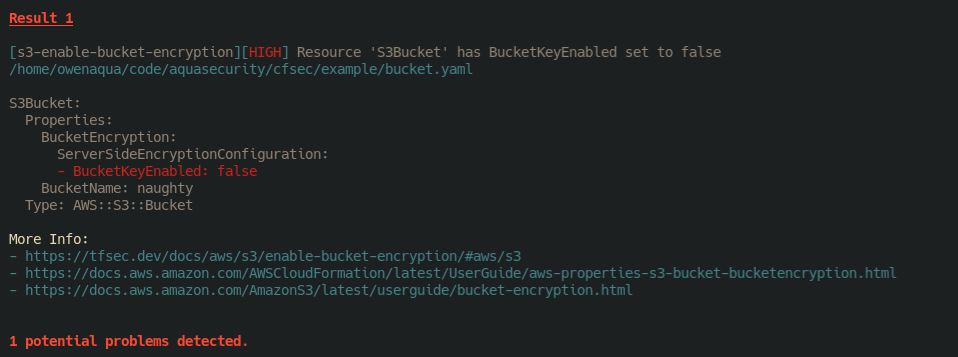

# cfsec

[](https://goreportcard.com/report/github.com/aquasecurity/cfsec)

> NOTE: cfsec is early release status - please raise issues and be patient

## What is it?

cfsec scans your yaml or json CloudFormation configuration files for common security misconfigurations.

## An Example

Given the CloudFormation configuration file below;

```yaml
Parameters:
  BucketName: 
    Type: String
    Default: naughty
  BucketKeyEnabled:
    Type: Boolean
    Default: false

Resources:
  S3Bucket:
    Type: 'AWS::S3::Bucket'
    Properties:
      BucketName: 
        Ref: BucketName
      BucketEncryption:
        ServerSideEncryptionConfiguration:
        - BucketKeyEnabled: 
            Ref: BucketKeyEnabled

```

Running the command `cfsec example.yaml`

The output would be



## More Information

cfsec scans single file Stack configurations with support for Parameters, Mappings and Resources. 

## Ignoring Findings

Ignores are available in yaml configurations only.

To add an ignore to a resource - on the line of the check add the ignore.

For example, to ignore S3 bucket encryption errors, you might use

```yaml
---
Resources:
  UnencrypedBucketWithIgnore:
    Type: AWS::S3::Bucket
    Properties:
      AccessControl: Private
      BucketName: unencryptedbits
      BucketEncryption:
        ServerSideEncryptionConfiguration:
          - BucketKeyEnabled: false # cfsec:ignore:aws-s3-enable-bucket-encryption
    
```

## Supported Intrinsic functions

Not all CloudFormation intrinsic functions are supported, we cover the list below

```
Ref
Fn::Base64
Fn::Equals
Fn::FindInMap
Fn::GetAtt
Fn::Join
Fn::Select
Fn::Split
Fn::Sub
```

In yaml configurations, cfsec supports both standard an short notation i.e; `!Base64` or `Fn::Base64`

## Limitations

- Not all intrinsic functions are supported
- `GetAtt` is extremely naive. We don't have visibility of attribute values so it is best effort
- Formats are limited to `default`, `json`, `csv`. [tfsec](https://tfsec.dev) support `default`, `json`, `csv`, `checkstyle`, `junit` and `sarif`. We aim to support these soon
- No support for nested stacks. cfsec takes the individual files in isolation with no visibility of 

## Comments, Suggestions, Issues

cfsec is very early stages, and we are committed to making it the best it can be. Please raise issues or suggestions through GitHub issues or discussion as appropriate.


