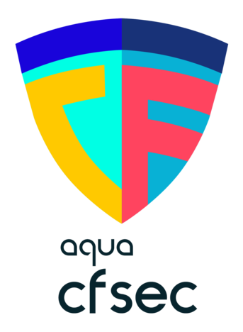
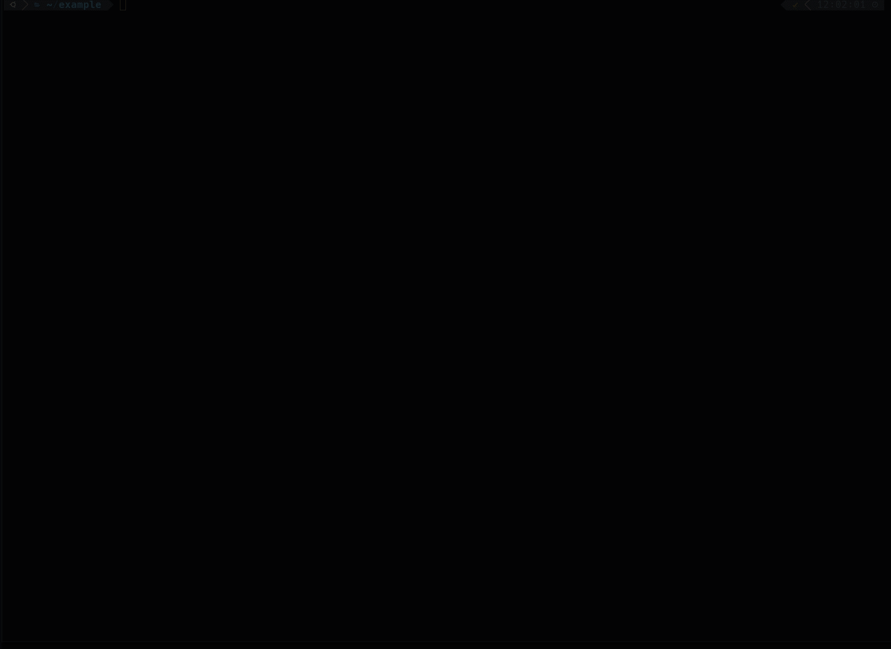

---
hide:
- navigation
- toc
---

{align=left}

 
 

`cfsec` is a static analysis security scanner for your `yaml` and `json` CloudFormation templates.

Designed to run locally and in your CI pipelines, developer-friendly output and fully documented checks mean detection and remediation can take place as quickly and efficiently as possible

`cfsec` takes a developer-first approach to scanning your CloudFormation templates; using static analysis and deep integration with the official HCL parser it ensures thatsecurity issues can be detected before your infrastructure changes take effect.

 
 

<figure style="text-align: center">
  
  <figcaption>Demo: Misconfiguration Detection</figcaption>
</figure>

`cfsec` is an [Aqua Security][aquasec] open source project.  
Learn about our open source work and portfolio [here][oss].  
Contact us about any matter by opening a GitHub Discussion [here][discussions]

[aquasec]: https://aquasec.com
[oss]: https://www.aquasec.com/products/open-source-projects/
[discussions]: https://github.com/aquasecurity/cfsec/discussions